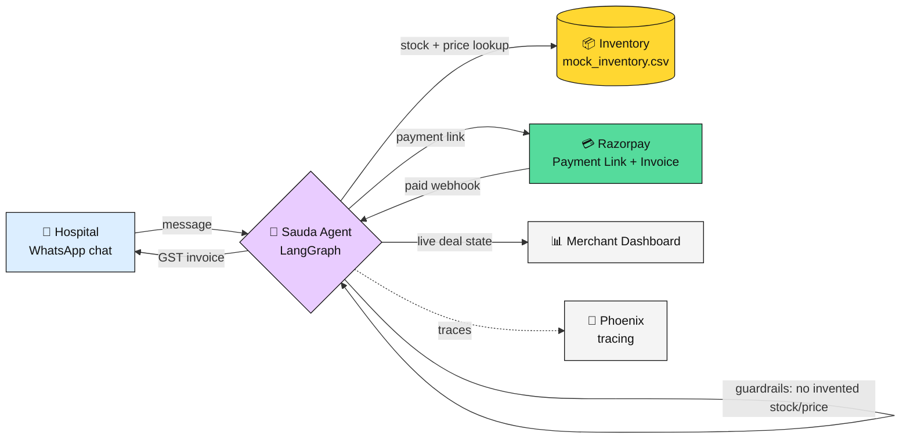

# Sauda

**Sauda: Autonomous B2B deal-maker via WhatsApp.** Built for the Razorpay Buildathon 2026 — Track 01: AI Growth and Agentic Commerce.

## The problem

A B2B surgical equipment distributor sells over WhatsApp, where deals go to whoever replies first with an accurate quote. A merchant juggling godown logistics can't reply fast enough — every hour of delay is a lost order and a lost commission.

## The solution

Sauda replies to a hospital's WhatsApp message in seconds: checks live inventory, negotiates within pre-approved margins, generates a Razorpay Payment Link, and — once paid — auto-generates and sends a GST invoice, all without manual intervention. Pricing and stock decisions are deterministic Python, never LLM guesswork; every step is traced for audit (Arize Phoenix).

## Architecture



## Repo layout

```
backend/
  app/agent/       LangGraph nodes + prompts — the state machine that reads, prices, negotiates
  app/api/         FastAPI routes — chat, WhatsApp webhook, Razorpay webhook, deals, orders
  app/services/    Inventory, LLM (Groq), Razorpay, WhatsApp clients
  app/data/        mock_inventory.csv + hardcoded hospital directory
  app/observability/  Phoenix/OpenTelemetry tracing
frontend/
  src/pages/       Merchant dashboard, hospital chat, login
  src/components/  Chat bubbles, status stepper, audit trail, avatars
docs/
  DESIGN.md        visual design tokens
  tasks/           one sub-PRD per unit of work
```

## Getting started

Requires [`uv`](https://docs.astral.sh/uv/) for the backend and Node.js 20+ for the frontend.

```bash
# Backend
cd backend
cp .env.example .env   # fill in real keys
uv sync
uv run uvicorn app.main:app --reload

# Frontend
cd frontend
npm install
npm run dev
```

Or, from the repo root: `make backend`, `make frontend`, `make test-backend`.

### Keys you need

| Key | For |
|---|---|
| `GROQ_API_KEY` | LLM (negotiation, extraction) |
| `RAZORPAY_KEY_ID` / `RAZORPAY_KEY_SECRET` | Payment links + invoices (test mode is fine) |
| `RAZORPAY_WEBHOOK_SECRET` | Verifying the real payment webhook |
| `WHATSAPP_TOKEN` / `WHATSAPP_PHONE_NUMBER_ID` / `WHATSAPP_VERIFY_TOKEN` | Real WhatsApp Cloud API (optional — the in-app chat UI works without these) |
| `PHOENIX_COLLECTOR_ENDPOINT` | Optional — LLM/agent tracing in [Arize Phoenix](https://docs.arize.com/phoenix) |
| `AGENT_API_KEY` | Securing the machine-readable buyer API |

## Known limitations

- Conversation state (per-sender `DealState`) lives in an in-memory dict, not a database — it resets on every backend restart. Acceptable for the buildathon demo; a real deployment needs durable storage.

## Future scope

- Real WhatsApp Business number (currently a hardcoded hospital directory + in-app chat, since a real merchant WhatsApp Business account wasn't available for this build).
- Dynamic freight costing via a logistics API (e.g. Porter, Borzo) as a real line item, instead of a flat "dispatch post-payment" note.
- Durable storage (Postgres) in place of the in-memory conversation/order store.
- Multi-merchant support.

## License

MIT — see [LICENSE](LICENSE).
